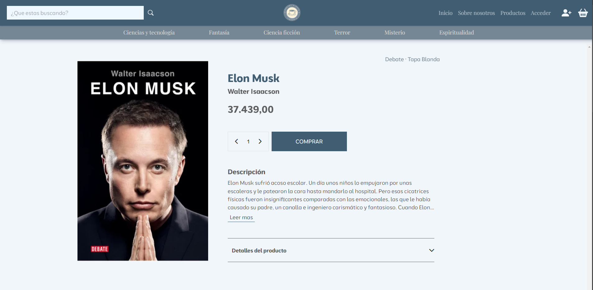

<p align='center'>
  <a href="https://cuentosycafe.netlify.app/">
    
  </a>
</p>
<div align='center'>
  <a href="https://developer.mozilla.org/es/docs/Web/HTML">
    
  </a>
  <a href="https://developer.mozilla.org/es/docs/Web/CSS">
    
  </a>
  <a href="https://developer.mozilla.org/es/">
    
  </a>
  <a href="https://getbootstrap.com/">
    
  </a>
</div>

# E-commerce de Libros 📚

Este proyecto es un e-commerce de libros donde los usuarios pueden navegar, agregar, editar y eliminar libros del catálogo utilizando JavaScript y `localStorage` para manejar el almacenamiento de datos.

## Características 🌟

- **CRUD Completo:** Los usuarios pueden **Crear**, **Leer**, **Actualizar** y **Eliminar** libros.
- **Interfaz Amigable:** Una interfaz de usuario simple e intuitiva.
- **Persistencia de Datos:** Utiliza `localStorage` para guardar los datos, permitiendo que los cambios persistan incluso después de recargar la página.
- **Filtrado y Búsqueda:** Capacidad para buscar libros y filtrarlos por categorías o precio.
- **Acceso de Usuario y Administrador:** Los usuarios pueden ingresar con credenciales específicas para acceder a funcionalidades adicionales de administración.

## Credenciales 🔑

Para acceder a las funcionalidades de administración, puedes usar las siguientes credenciales:

### Admin

- **Usuario:** `@admin`
- **Contraseña:** `Adm1n$tr0ngPassw0rd!`

### Invitado

- **Usuario:** `@guest`
- **Contraseña:** `Guest123!`

> **Nota:** Las credenciales de administrador proporcionan acceso completo al sistema. Las credenciales de invitado permiten un acceso limitado.


## DEMO 🌍

Mira una demostración del proyecto [aquí](https://cuentosycafe.netlify.app/)

## Instalación 🚀

**Clonar el Repositorio:**

```bash
$ git clone https://github.com/WalterGonzalez33/cuentos-y-cafe-shop.git
$ cd cuentos-y-cafe-shop
```
## Trabajo en Equipo 🤝

Este proyecto fue desarrollado en equipo, combinando nuestros esfuerzos y habilidades para crear una aplicación funcional y atractiva. Cada miembro del equipo contribuyó con ideas, programación, y pruebas para asegurar que el e-commerce de libros ofreciera la mejor experiencia posible a los usuarios. ¡Gracias a todos por su dedicación y colaboración!

## Desarrolladores 💻

| [](https://github.com/WalterGonzalez33)  | [](https://github.com/BritoAugusto) | [](https://github.com/avila78) | [](https://github.com/FabricioNeme) |
|---|---|---|---|
| [Walter Gonzalez](https://github.com/WalterGonzalez33) | [Augusto Brito](https://github.com/BritoAugusto) | [Luis Avila](https://github.com/avila78) | [Fabricio Neme](https://github.com/FabricioNeme) |

<div align="center">
    <p>¡Gracias por visitar este repositorio! 🎉</p>
</div>